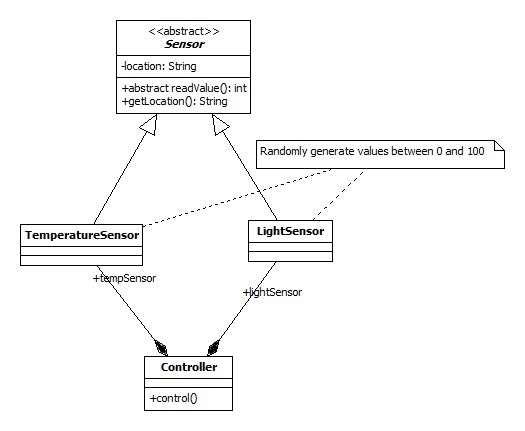

## Exercise 1


### Requirements

- make a new package called exercise1 inside your current lab package
- inside the previous created package, make four classes with the same names as the ones that are in the Class Diagram. Also add one
  more class called Main
- the four classes will have the attributes, constructors and methods implemented based on the Class Diagram
- getArea() and getPerimeter() from Shape are abstract, they will be implemented in Circle and Rectangle with proper implementation, and
also overrided in Square ⟶ hint: see abstraction + inheritance in action 
- inside the Main class add the main method. After, make an array of Shapes, fill it with Circle, Rectangle and Square objects and test 
  the methods: getArea(), getPerimeter() and toString() ⟶ hint: see polymorphism in action


## Exercise 2

```
public interface Image {
   void display();
}
 
public class RealImage implements Image {
 
   private String fileName;
 
   public RealImage(String fileName){
      this.fileName = fileName;
      loadFromDisk(fileName);
   }
 
   @Override
   public void display() {
      System.out.println("Displaying " + fileName);
   }
 
   private void loadFromDisk(String fileName){
      System.out.println("Loading " + fileName);
   }
}
 
public class ProxyImage implements Image{
 
   private RealImage realImage;
   private String fileName;
 
   public ProxyImage(String fileName){
      this.fileName = fileName;
   }
 
   @Override
   public void display() {
      if(realImage == null){
         realImage = new RealImage(fileName);
      }
      realImage.display();
   }
}
````

### Requirements

- make a new package called exercise2 inside your current lab package
- for every class and interface listed above, make proper class and interface translation into the package created before
- create the Class Diagram for the listed code, for this you can use [Start UML](https://staruml.io/) or any tool to design UML diagrams
- save the diagram as `.jpg (or another image format)` and in this package as well
- add a new class RotatedImage that will implements Image. This class is a clone for RealImage ⟶ hint: you can copy RealImage
  and edit constructor's name
- display() method from RotatedImage will return ``“Display rotated ” + fileName``;
- edit ProxyImage class and also that depending on a constructor argument given in this class, in the display() method make a new 
  object and call display() method for that object. ``Also you can't add dependecy relation or an RotatedImage 
  attribute ⟶ hint: use abstraction, this will prove you that you understand abstraction principle and polymorphism``
- create a Main class and inside the main method. In the main method create a ProxyImage object and test its functionality


## Exercise 3


### Requirements

- make a new package called exercise3 inside your current lab package
- inside the previous created package, make four classes with the same names as the ones that are in the Class Diagram. Also add
  one more class called Main
- take care that Sensor is an abstract class and location is inherited in subclasses too. Proper handle location in subclasses.
- readValue() will be overridden in subclasses and also will generate a value between 0 - 100
- control() method will read and display temperature and light values with a period of 1 second for duration of 20 seconds
- in the Main class add main method and test there the control method
- in the main method also write as comments the relations between classes 


#### For waiting a second you can use

```
try {
    Thread.sleep(1000);
} catch (InterruptedException e) {
    e.printStackTrace();
}

```


## Exercise 4

### Requirements

- make a new package called exercise4 inside your current lab package
- make the Controller class from #exercise-4 be implemented as a [Singleton](http://radumiron.net/doku.php?id=java1:proiectare:dp:singelton)
- `Very important to not alter Exercise 3, for that here add all that classes again`


### Exercise 5



### Requirements

- make a new package called exercise5 inside your current lab package
- implement the Class Diagram with the same requirements as at Exercise 3, but `take care that here are other relations between classes`
- in the main method also write as comments the relations between classes


